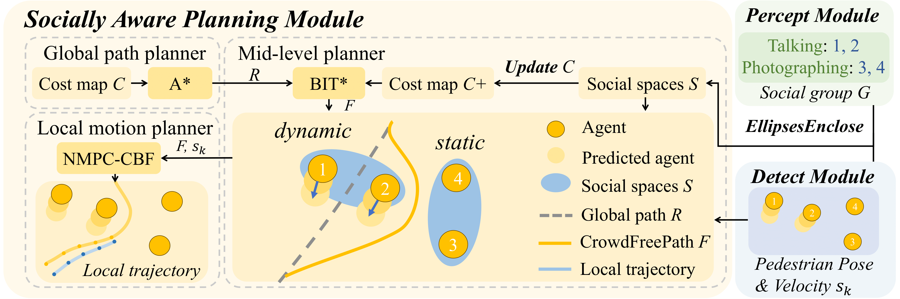

# Socially Aware Planning Module
To leverage **social group identification** results for guiding robot planning, we propose a socially aware planning module, which consists of three levels:  
- **Global path planning** – generates a collision-free reference path on a static map.  
- **Mid-level planning** – re-plans paths in human social space, considering group interactions.  
- **Local motion planning** – tracks the reference path with dynamic obstacle avoidance.  

---

<!-- Centered framework image -->
<p align="center">
  
</p>

---

## ⚙️ Installation

```bash
git clone https://github.com/MrCasual1215/GSON_Planner.git
cd SocialPlanner
pip install -r requirements.txt
```

Dependencies:

* Python ≥ 3.8
* ROS Noetic (with `rospy`, `tf`, `tf2_ros`)
* Core libraries: `casadi`, `numpy`, `scipy`, `matplotlib`, `opencv-contrib-python`, `rospkg`

---

## 🚀 Quick Start

```bash
roslaunch SocialPlanner planner.launch
```


## 📂 Project Structure

```yaml
SocialPlanner/
├── config/                 # YAML configuration files
│   └── config.yaml
├── docs/                   # Documentation, figures
│   └── planning.png
├── include/ourplanner/     
├── launch/                 # ROS launch files
│   └── planner.launch
├── map/                    # Map and planner-related files
│   ├── global_planner/     # Global planner maps/configs
│   └── middle_planner/     # Mid-level planner configs
├── msg/                    # Custom ROS message definitions
│   ├── circle.msg
│   ├── dynamic_obstacles.msg
│   ├── ellipses.msg
│   ├── global_path.msg
│   ├── polygons.msg
│   └── pose.msg
├── rviz/                   # RViz visualization configs
│   └── planner.rviz
├── scripts/                # Python implementations
│   ├── global_planner.py   # A* based global planner
│   ├── middle_planner.py   # BIT* based mid-level planner
│   ├── local_planner.py    # NMPC-CBF based local planner
│   ├── planner_utils/      # Utility functions
│   └── utils/              # Shared helper modules
├── src/                   
├── package.xml             # ROS package metadata
├── requirements.txt        # Python dependencies
└── README.md
```

---

## 🔧 Configuration

Main configuration file: `config/config.yaml`

```yaml
global_planner:
  goal_predefined: true        # Whether to use a fixed predefined goal
  path_predefined: false       # Whether to load a predefined path
  goal_x: 1.0                  # Goal x-coordinate (meters)
  goal_y: -2.5                 # Goal y-coordinate (meters)
  path_x: []                   # Predefined path x-points (if path_predefined=true)
  path_y: []                   # Predefined path y-points
  planner_params:
    floyd: true                # Apply Floyd-Warshall smoothing
    bspline: true              # Apply B-spline smoothing
    bspline_order: 2           # Order of B-spline

map_manager:
  erode_size: 2                # Erosion size for obstacle processing
  inflate_size: 10             # Obstacle inflation (grid cells)
  person_inflate_size: 0.3     # Inflation radius for single pedestrians (m)
  group_inflate_size: 0.4      # Inflation radius for social groups (m)

group_manager:
  predicted_steps: 2           # Prediction horizon for group motion (timesteps)

timestep: 0.1                  # Simulation/control timestep (s)
```

